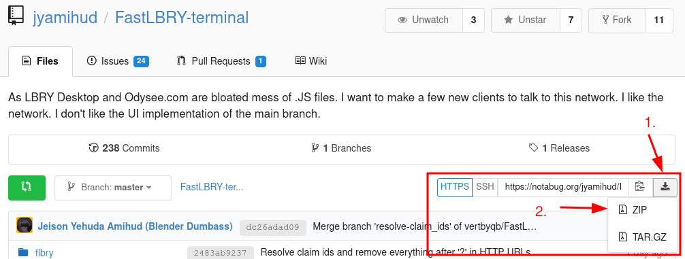

# FastLBRY terminal

```
█▓▓█▓▓▓▓▓▓█▓██▓▓▓▓▓▓▓█▓▓▓▓▓▓█▓▓▓▓██▓▓▓▓█▓▓▓▓█
▓▒▒▒▒▒▒▒▓▒▒▒▒▒▒▒▓▓▒▒▒▒▒▒▒▒▒▓▒▒▒▒▒▒▒▒▒▓▒▒▒▒▓▒▓
██░░░▒░░░░░░▒░░░░░░░▒░░░░░░░░░▒░░▒░░░░░░░░▒▓▓
▓▓░ ░          ░             ░    ■     ■░░▒▓
▓▒▒ ╔════════■   ░  ╔════╗ ╔════╗ ║  ░  ║ ░▓█
▓▒░ ║ ░      ║      ║    ║ ║    ║ ║     ║ ░▒▓
█▓░░║        ║      ╠════╣ ╠═╦══╝ ╚══╦══╝ ▒▒▓
▓▒▒ ╠══ AST ■║      ║    ║ ║ ╚══╗    ║   ░░▒█
█▒░ ║        ║      ║    ║ ║    ║    ║    ░▓▓
▓▓░ ║    ░   ╚═════■╚════╝ ■    ■ ░  ║ ░  ░▒▓
▓▒░░║ ░       THE TERMINAL CLIENT    ║    ▒▒█
█▒▒ ■      ░                  ░      ■ ▒░ ░▓▓
▓▒░░░░░░░▒░░░░▓░░░░░▒░░░░░░░░░▒░░░░▒░░░░░░░▒█
▓▓▒▒▒▒▓▒▒▒▒▒▓▒▒▒▒▓▒▒▓▒▒▒▒▒▒▒▓▓▒▒▒▒▒▒▓▒▒▒▒▒▓▓▓
█▓▓█▓▓▓▓▓████▓▓▓▓█▓▓▓▓█▓▓▓▓██▓▓▓█▓▓▓▓▓█▓▓▓▓██
```

This is one of the **3 programs** that will be the FastLBRY project. There is not enough choice when it comes to LBRY. The two major clients are the Odysee.com website ([which may become proprietary in the future](https://odysee.com/@lbry:3f/lbryandodyseeevolving:7)) or LBRY Desktop which shares its [source code](https://github.com/lbryio/lbry-desktop) with Odysee, making it a sub-optimal solution. LBRY Desktop is more local, but it's still a [tiny browser](https://www.electronjs.org/) with a website on it.

If you look on what's running on Odysee.com, you will discover a bloated mess of [compiled JavaScript](https://www.gnu.org/philosophy/javascript-trap.html) on top of other bloated mess of JavaScript. Pages barely contain HTML5 code. I've [talked to them about this](https://github.com/lbryio/lbry-desktop/issues/6197) and all they could say was:

> Thank you for the issue and write up. This is not something we plan to do anytime soon since we rely on the open-source videojs framework heavily. We may consider it in the future.

Fine. You won't do that. How about me? Maybe I can do that. It's Free / Libre Software we are talking about. You don't need a permission to start implementing things.

Here is the plan for this project:

 - **FastLBRY Terminal**. A fully featured, terminal application to interact with LBRY. It will allow watching videos, downloading files, viewing and sending comments, uploading new files, and more. This is mostly feature complete, and all of the features mentioned before are implemented already.
 - **FastLBRY GTK**. A fully featured graphical application. It will have all the same features as the FastLBRY Terminal but with a GUI that a basic user might understand. It will require a bit of UI design work. I don't want it to resemble YouTube. LBRY is way deeper then just a clone of YouTube. I want the design to showcase the LBRY network correctly. This is in its early stages. You can find its repository [here](https://notabug.org/jyamihud/FastLBRY-GTK).
 - **FastLBRY HTML5**. A fully featured server application, released under the [GNU AGPL](https://www.gnu.org/licenses/agpl-3.0.en.html) this time. That people could install to make instances of LBRY on the web. But instead of it being this bloated mess of JavaScript, it will be a straight forward HTML5 site, with little to no JavaScript. And only for secondary features ( like live notifications for comments ). So it will not break core features if the user decides to block all JavaScript.

# Installation

If you have [git](https://git-scm.com/) installed (available in most GNU+Linux repositories as simply `git`) you can clone the repository using this command:
```
git clone https://notabug.org/jyamihud/FastLBRY-terminal.git
```

Or you can download a compressed version of the project by clicking the download symbol on the far right of the repository link.


To run the program, go to the directory it is cloned (or extracted) to and run:
```
python3 run.py
```

For [Arch GNU+Linux](https://archlinux.org/) users, FastLBRY Terminal is on the AUR as `fastlbry-terminal-git`. Once it is installed, you can run `fastlbry-terminal` from a terminal to run the program.

For now FastLBRY Terminal is a rolling-release piece of software, but we are steadily working our way to a 1.0 release. Technically there is a 0.5 release, but its use is highly discouraged as it is very out of date.

[Python 3](https://www.python.org/) is a dependency for running FastLBRY Terminal.

# WE NEED HACKERS!!! WE NEED YOU!!!

This project requires a lot of work to be done. The good thing is that it's based on [Python](https://www.python.org/). Without using too many complex features. We do use the [lbrynet SDK](https://github.com/lbryio/lbry-sdk) for now, though we would like to eventually rewrite the SDK under the [GNU GPL](https://www.gnu.org/licenses/gpl-3.0.en.html) later on.

If you know nothing about programming, this is a good way to start. If you know something about programming, this is a good opportunity to contribute. To learn things needed to hack on this project and to help it be where it needs to be you can use the following resources:

 - [Python Basics](https://pythonbasics.org/) to learn the basic syntax of python. You can use this as a handbook when ever you don't understand a line. Or when ever you need a way to implement a thing.
 - [LBRY SDK API](https://lbry.tech/api/sdk) to learn all kinds of possible things that you can do with the SDK. Alternatively you can go to the folder `flbry` ( using `cd flbry` ) and then run the  `./lbrynet --help` command to see various commands of the SDK.
 - [DuckDuckGo](https://duckduckgo.com/) a search engine that can help you find answers for things that are not documented in any of the previous places. Sometimes you may need to go to the second page.
 - [The Matrix Chat](https://app.element.io/#/room/#FastLBRY:matrix.org) (`#FastLBRY:matrix.org`) where you can hang out with an already quite substantial amount of users / hackers of FastLBRY. The main developers are also there, so if you have any question what so ever just post it there.

**VIDEO TUTORIAL ON HOW TO HACK IT**

[](https://librarian.bcow.xyz/@blenderdumbass:f/hacking-on-fast-lbry:9)

*Click the image to watch on Librarian or...* [Direct Spee.ch link](https://spee.ch/@blenderdumbass:f/hacking-on-fast-lbry:9)

***Note: this video is on an outdated version of FastLBRY Terminal***

Now open the `run.py` file in your [preferred editor](https://www.gnu.org/software/emacs/) and start hacking.

# Donation Information

This project has a built in donation system using LBC (LBRY's built-in cryptocurrency). Users choose to donate to the contributors and the funds are spread between the contributors.

[...Read more about the Donation System here...](help/donate.md)

# Plugins

FastLBRY Terminal now supports extensions. For information on how it works and what parts support extending please read the [plugins manual](help/plugins.md).

# To do list

To get an idea of what needs to be done, here is a checklist of things. Alternatively, you can look at the [Issues page](https://notabug.org/jyamihud/FastLBRY-terminal/issues) for various issues found by the users, that you can help to fix as well.

**Basic Features:**

 - [x] Search / List channel publications / See Trending
 - [x] Download / get https link / watch videos / read articles.
 - [x] Setup and upload new publications
 - [x] Read and write comments and replies
 - [x] See wallet history
 - [x] See balance
 - [x] Send support / send LBC to addresses
 - [x] View Following
 - [x] Follow new channels
 - [ ] Login *(currently requires [logging in from LBRY Desktop](https://notabug.org/jyamihud/FastLBRY-terminal/src/master/help/login.md))* [Issue #17](https://notabug.org/jyamihud/FastLBRY-terminal/issues/17)

**Nice to have things**

 - [x] Make UI fit to the terminal size.
 - [ ] Changing the `lbrynet` binary to a full python implementation. [Issue #3](https://notabug.org/jyamihud/FastLBRY-terminal/issues/3)
 - [x] Analytics
 - [ ] Multi-Language support [Issue #21](https://notabug.org/jyamihud/FastLBRY-terminal/issues/21), [Issue #32](https://notabug.org/jyamihud/FastLBRY-terminal/issues/32)

# Licensing

The project is copyright J.Y.Amihud and Other Contributors 2021, under the [GNU General Public License Version 3](https://notabug.org/jyamihud/FastLBRY-terminal/src/master/LICENSE.md) or **any later version**. This choice will protect this project from becoming [proprietary](https://www.gnu.org/proprietary/proprietary.html).

Unfortunately, the LBRY SDK which the project relies on is copyright LBRY Inc. and is under the [Expat License](https://www.gnu.org/licenses/license-list.html#Expat) (also known as the MIT license). [Click here to read their license.](./LBRYNET-LICENSE.md), which wasn't our choice. We are thinking about reimplementing the LBRY SDK under the GNU GPL sometime later so we do not have to use lbrynet.

# User help

If you have a question or an issue please tell us about it. We are not magical wizards. We can't read your mind. And we don't have telemetry. So it's on you to tell us about errors and other annoyances. You can use the:

 - [Issue tracker](https://notabug.org/jyamihud/FastLBRY-terminal/issues)
 - [Matrix Chat](https://app.element.io/#/room/#FastLBRY:matrix.org) (`#FastLBRY:matrix.org`)

 Happy Hacking!
